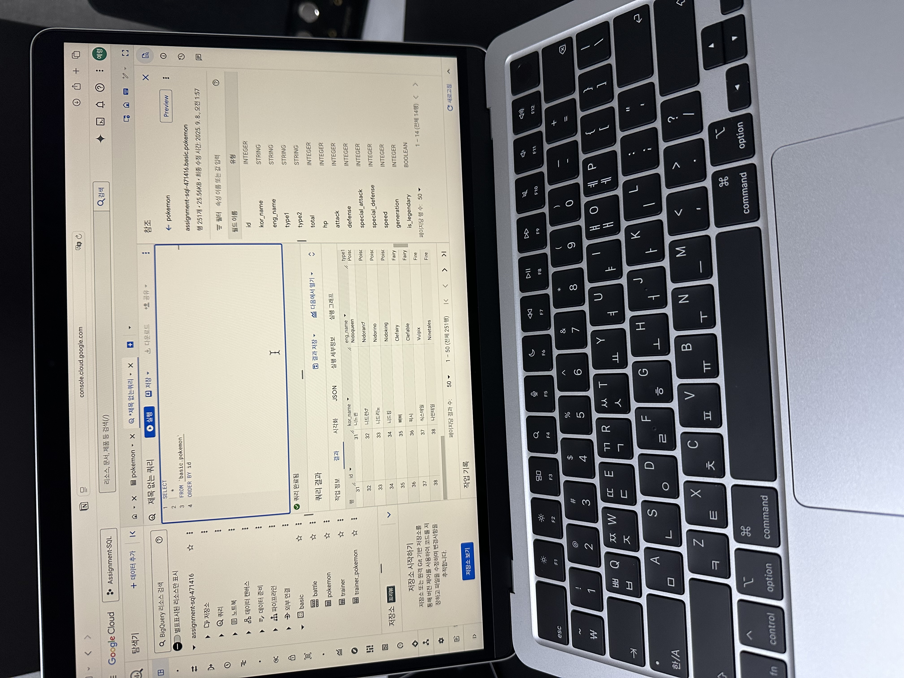
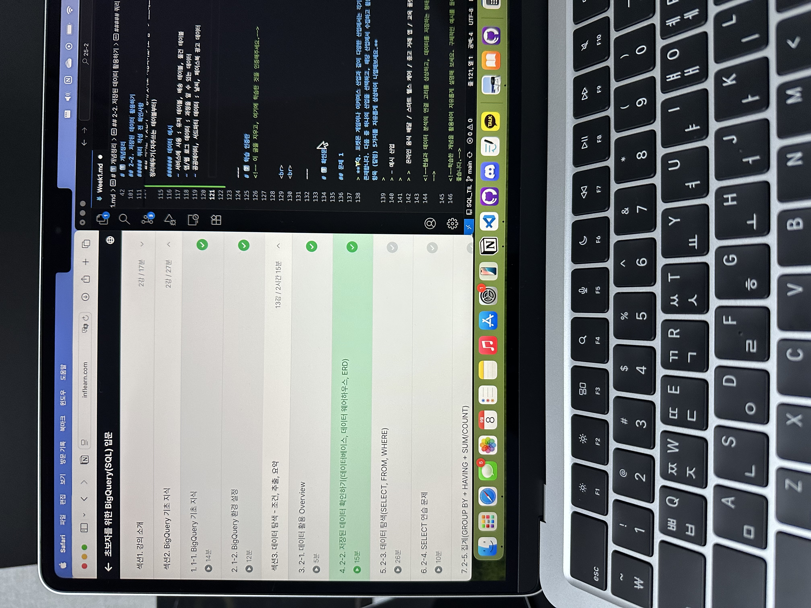

# SQL_BASIC 1주차 정규 과제 

📌SQL_BASIC 정규과제는 매주 정해진 분량의 `초보자를 위한 BigQuery(SQL) 입문` 강의를 듣고 간단한 문제를 풀면서 학습하는 것입니다. 이번주는 아래의 **SQL_Basic_1st_TIL**에 나열된 분량을 수강하고 `학습 목표`에 맞게 공부하시면 됩니다.

**1주차 과제**에서는 수강한 내용을 모두 요약 정리하기보다는, **SQL이 왜 필요한지에 대해 배우고 느낀 점, 그리고 강의를 듣고 본인이 원하는 목표를 중심으로 작성**하여 과제 업로드 시트에 깃허브 링크를 스프레드시트 'SQL' 시트에 붙여서 넣어주세요. 

**👀(수행 인증샷은 필수입니다.)** 

## SQL_BASIC_1st_TIL

### 섹션 2. BigQuery 기초 지식

### 1-1. BigQuery 기초 지식

### 1-2. BigQuery 환경 설정

## 섹션 3. 데이터 탐색 - 조건, 추출, 요약

### 2-1. 데이터 활용 Overview 

### 2-2. 저장된 데이터 확인하기

## 🏁 강의 수강 (Study Schedule)

| 주차  | 공부 범위              | 완료 여부 |
| ----- | ---------------------- | --------- |
| 1주차 | 섹션 **1-1** ~ **2-2** | ✅         |
| 2주차 | 섹션 **2-3** ~ **2-5** | 🍽️         |
| 3주차 | 섹션 **2-6** ~ **3-3** | 🍽️         |
| 4주차 | 섹션 **3-4** ~ **4-4** | 🍽️         |
| 5주차 | 섹션 **4-4** ~ **4-9** | 🍽️         |
| 6주차 | 섹션 **5-1** ~ **5-7** | 🍽️         |
| 7주차 | 섹션 **6-1** ~ **6-6** | 🍽️         |

 

<!-- 여기까진 그대로 둬 주세요-->

---

# 1️⃣ 개념정리 
<!-- 강의 수강 이후에 아래의 학습 목표에 맞게 개념을 자유롭게 정리해주세요.-->
## 1-1. BigQuery 기본지식

~~~
✅ 학습 목표 :
* 데이터 관련 기초 지식(OLTP, SQL, Row, Column, 저장 형태 등)을 설명할 수 있다. 
* BigQuery 관련 기초 지식에 대해서 파악할 수 있다. 
~~~

<!-- 새롭게 배운 내용을 자유롭게 정리해주세요.-->
##### OLTP(online transaction processing)
- 거래를 하기 위해 사용되는 데이터베이스 
- 데이터 무결성: 보류, 중간 상태가 없음 
- INSERT, UPDATE 많이 발생 
- SQL 사용할 수 있지만 속도가 느릴 수 있음
- OLAP: 분석을 위한 기능 제공

##### SQL
- 데이터베이스의 데이터를 관리하기 위해 설계된 프로그래밍 언어
- 쿼리문, 쿼리를 짠다, SQL쿼리 등으로 표현

##### 테이블 구조
- Row: (음식점, 음식, 주문시간 등) 하나의 고유한 데이터 / 가로
- Column: (구매시간 등) 각 데이터의 특정 속성값 / 세로

##### 데이터 웨어하우스: 데이터를 한 곳에 모아서 저장
- google cloud의 OLAP + Data Warehouse = BigQuery
- SQL 사용
- 속도가 매우 빠름(비쌈)
- 앱 개발(Firebase), 웹개발(Google Analytics 4)의 데이터를 쉽게 추출 가능
- 쏘카, 당근, 컬리, 마이리얼트립 등등이 사용

    - 쿼리 비용: 데이터 탐색 시 발생하는 비용
    - 저장 비용: 용량 비용
___
- 프로젝트: 하나의 큰 건물
- 데이터셋: 프로젝트에 있는 창고
- 테이블: 창고에 있는 선발

## 2-1. 데이터 활용 Overview

~~~
✅ 학습 목표 :
* 데이터를 활용하는 과정을 설명할 수 있다.
* 데이터를 탐색하는 과정으로 조건과 추출, 요약을 할 수 있다. 
~~~

<!-- 새롭게 배운 내용을 자유롭게 정리해주세요.-->
#### 데이터 활용 과정
1. task: 문제 정의, 목표 설정
2. 데이터 탐색 - 단일/다량 자료-연결
3. 조건/추출/변환/요약
4. 데이터 결과 검증
5. 피드백/활용
SQL -> 데이터 탐색과 결과 검증

## 2-2. 저장된 데이터 활용하기

~~~
✅ 학습 목표 :
* 데이터가 저장되는 형태를 알고 저장된 데이터를 활용할 수 있다. 
~~~

<!-- 새롭게 배운 내용을 자유롭게 정리해주세요.-->
#### 쿼리 작성 전 확인사항
- 데이터가 어떻게 저장되어 있는가 -> 데이터 웨어하우스
- 어떤 데이터가 저장되어 있는가 -> ERD(entity relationship diagram)
- 컬럼 의미는 무엇인가 -> 영어/숫자로 저장되어있기도 함 -> 스프레드시트나 문서로 따로 정리해두기(자주쓰는 테이블부터)

##### 데이터 예시
- 서비스에 사용 : 유저 테이블, 배송 테이블, 물건 테이블
- 앱/웹 로그 데이터 : 과정을 알 수 있는 데이터
- 공공데이터, 서드파티 데이터 : 날씨, 페이스북 광고 데이터

---
# 2️⃣ 학습 인증란

 
 

---

# 3️⃣ 확인문제

## 문제 1

> **🧚Q. 포켓몬 게임이나 이커머스 산업과 같이 다양한 산업에서는 각기 다른 데이터가 존재합니다. 다음 중 하나의 산업을 선택하고, 해당 산업에서 수집하고 활용될 수 있는 데이터 항목 (칼럼) 5가지를 자유롭게 상상하여 나열해보세요.**
>
> - 예시 산업 
>
> >  온라인 음식 배달 / 스마트 헬스 케어 / 중고 거래 앱 / 교육 플랫폼 등 

<!--현실과 데이터 분석의 연결 고리를 상상하고, 데이터를 저장하는 형태를 활용하는 문제입니다. -->

<!--학습한 개념을 활용하여 자유롭게 설명해 보세요. 구체적인 예시를 들어 설명하면 더욱 좋습니다.-->

~~~
<중고 거래 앱>
사용자 id, 사용자 거래내역, 판매 상품, 판매자 id, 구매자 id
~~~

## 문제 2

> **🧚Q. 이번 강의를 통해 SQL이 왜 필요하다고 느끼는지, SQL을 통해 본인이 어떤 것을 해내고 싶은지를 자유롭게 작성해보세요.**

~~~
SQL은 데이터 분석 시 데이터 탐색과 결과를 검증할 때 활용된다. 우리가 회사나 학교를 다니면서 프로젝트를 진행하는 등 실생활에서 특정 목적을 가지고 데이터를 수집할 때의 데이터는 대부분 데이터베이스 형태로 저장되어 있다. 이를 효율적으로 다루기 위한 프로그래밍 언어가 SQL이다. 

수업에서 언급되었던 예시와 같이 배달앱에서 음식을 주문하는 고객의 패턴을 파악하는 분석을 하여 배달앱 구성을 수정하는 등의 결론을 이끌어내는 작업을 하고 싶다. 아직 실무적으로 SQL이 정확히 어떻게 쓰이는지 실제 데이터를 활용한 분석을 진행해 본 경험이 없기 때문에 SQL을 활용하여 위와 같은 데이터 분석을 하여 인사이트를 도출하고 싶다. 
~~~

### 🎉 수고하셨습니다.

