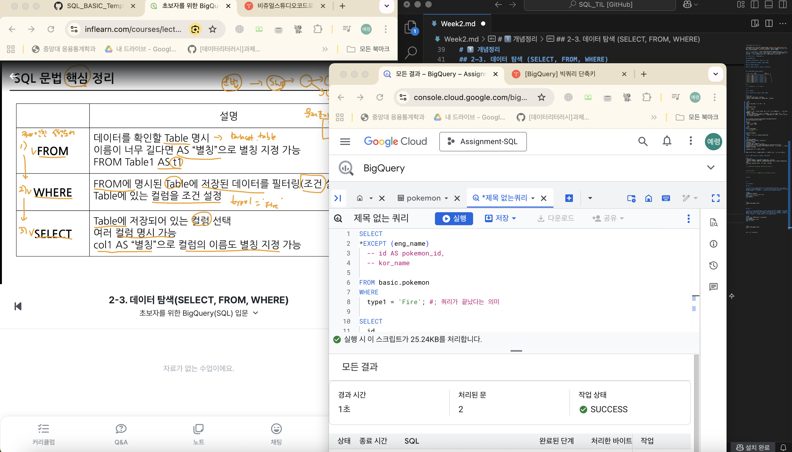
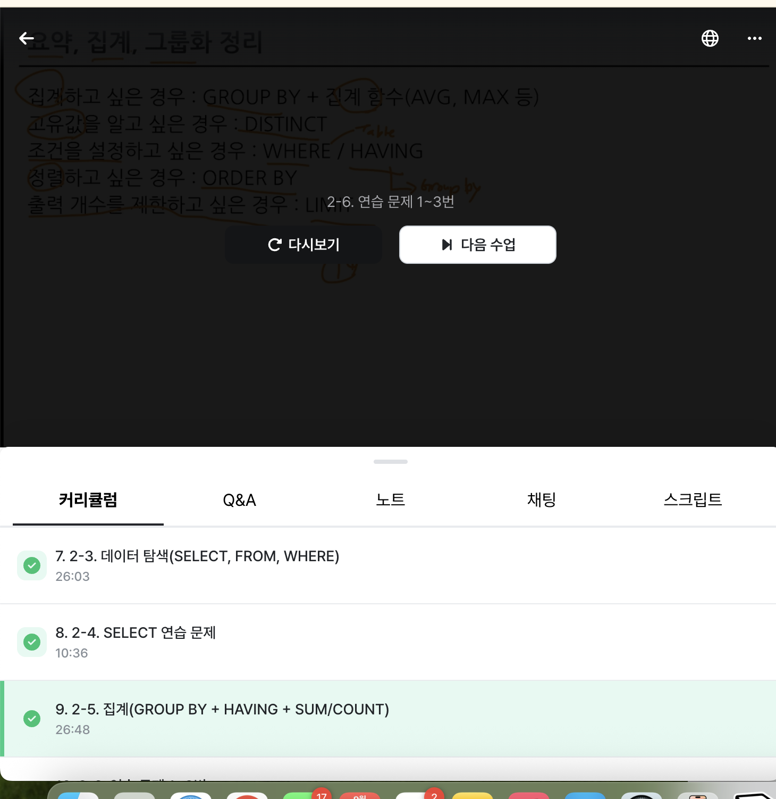

# SQL_BASIC 2주차 정규 과제 

📌SQL_BASIC 정규과제는 매주 정해진 분량의 `초보자를 위한 BigQuery(SQL) 입문` 강의를 듣고 간단한 문제를 풀면서 학습하는 것입니다. 이번주는 아래의 **SQL_Basic_2nd_TIL**에 나열된 분량을 수강하고 `학습 목표`에 맞게 공부하시면 됩니다.

**2주차 과제**는 1주차 과제처럼 SQL의 필요성이나 느낀점 위주가 아닌, **실제 강의 내용을 바탕으로 개념을 정리하고 학습한 내용을 집중적으로 기록**해주세요. 완성된 과제는 Github에 업로드하고, 링크를 스프레드시트 'SQL' 시트에 입력해 제출해주세요. 

**👀(수행 인증샷은 필수입니다.)** 

## SQL_BASIC_2nd

### 섹션 3. 데이터 탐색 - 조건, 추출, 요약

### 2-3. 데이터 탐색 (SELECT, FROM, WHERE)

### 2-4. SELECT 연습문제

### 2-5. 집계 (Group By + Having + Sum/Count)


## 🏁 강의 수강 (Study Schedule)

| 주차  | 공부 범위              | 완료 여부 |
| ----- | ---------------------- | --------- |
| 1주차 | 섹션 **1-1** ~ **2-2** | ✅         |
| 2주차 | 섹션 **2-3** ~ **2-5** | ✅         |
| 3주차 | 섹션 **2-6** ~ **3-3** | 🍽️         |
| 4주차 | 섹션 **3-4** ~ **4-4** | 🍽️         |
| 5주차 | 섹션 **4-4** ~ **4-9** | 🍽️         |
| 6주차 | 섹션 **5-1** ~ **5-7** | 🍽️         |
| 7주차 | 섹션 **6-1** ~ **6-6** | 🍽️         |

<br>

<!-- 여기까진 그대로 둬 주세요-->

---

# 1️⃣ 개념정리 

## 2-3. 데이터 탐색 (SELECT, FROM, WHERE)

~~~
✅ 학습 목표 :
* SQL 쿼리 구조를 이해할 수 있다. 
* SELECT, FROM, WHERE의 핵심 문법을 설명할 수 있다. 
~~~

# sql 쿼리 구조 _ 조건 , 추출

SELECT - FROM - WHERE

FROM (테이블 명시) -> WHERE (필터링) -> SELECT (컬럽 선택) 순으로 실행됨. 

```SQL
SELECT
 Col1 AS new_name, :AS 로 별칭 지정
 Col2,
 Col3
FROM Dataset.Table
WHERE
 Col = 1 :조건문
 ```
- SELECT * : 모든 컬럼을 출력하겠다 -> 행이 적으면 이슈가 없지만, 많을 경우 비용 많이 나가므로 주의!
- SELECT * EXCEPT(제외할 컬럼) -> join에서 유용, 컬럼 개수 많을 때 유용
- 각 table 에서 어떤 데이터를 추출할 것인가 집합으로 생각하고 쿼리를 짜면 좋음!
- AS 는 따옴표 없이 기록. 


[빅쿼리]https://console.cloud.google.com/bigquery?pli=1&project=assignment-sql-471416

#단축키
- cmd + / : 주석처리
- cmd + enter : 실행

```SQL
SELECT  
*EXCEPT (eng_name)
  -- id AS pokemon_id, 
  -- kor_name

FROM basic.pokemon 
WHERE 
  type1 = 'Fire'; #; 쿼리가 끝났다는 의미

SELECT
  id
FROM basic.pokemon
# assignment-sql-471416 : project ID
# basic : dataset
# pokemon : table
# <project ID>, <dataset>, <table>
# project ID는 꼭 명시할 필요 없을 수도 있음(프로젝트 단일이라면)
# 프로젝트를 여러개 사용하는 경우 명시하는 것이 좋음 -> 쿼리 실행할 때 어떤 프로젝트인지 확인하는 과정 필요

# 가독성 있는 쿼리 -> 협업 시 중요
```


## 2-5. 집계 (Group By / HAVING / SUM,COUNT)

~~~
✅ 학습 목표 :
* 데이터를 집계하고 그룹화하는 방법을 설명할 수 있다.
* GROUP BY, HAVING, ORDER BY, 집계함수(SUM/COUNT 등)을 활용하는 방법을 설명할 수 있다.
* having과 where의 차이에 대해서 설명할 수 있다.
~~~

요약 -> 집계: 모아서 계산함

언제 사용?
- 일자별 집계
- 연령대별 집계
- 특정 타입별 집계
- 앱 화면별 집계(어떤 화면에 유저가 많이 접근했는가)
- 일자별+제품타입별 판매량(count)


# GROUP BY
- 같은 값끼리 모아서 그룹화; 특정 컬러미 기준으로 모으면서 다른 컬럼에선 집계 가능
- ex. 타입을 기준으로 그룹화해서 평균 공격력 집계, 타입별 포켓몬 수 집계

# ORDER BY
- 내림/오름차순(default)
- 쿼리의 맨 마지막에 둠.

# LIMIT
- row 수를 제한하고 싶은 경우 사용
- 쿼리문 제일 마지막에 작성


# HAVING vs WHERE
- WHERE : 테이블에 '바로' 조건을 설정하고 싶은 경우
- HAVING : GROUP BY 한 후에 조건 설정하고 싶은 경우 

# DISTINCT 
- unique한 것만 보고 싶은 경우
- 중복 제거 .. group by 도 가능


# 집계함수 쓰는 구조
```sql
SELECT
집계할_컬럼1,
 집계 함수(COUNT, MAX, MIN 등)
FROM Table
GROUP BY
 집계할_컬럼1
```
# 서브쿼리
- SELECT 문 안에 들어있는 SELECT 쿼리


# 2️⃣ 학습 인증란

<!-- 이 글을 지우고, 여기에 학습한 것을 인증해주세요.-->




<br><br>


---

# 3️⃣ 확인문제

## 문제 1

> **🧚Q. 포켓몬 마스터 승화는 포켓몬 데이터 조회하는 SQL문에 재미를 느껴서 혼자서 데이터를 조회하는 쿼리문을 짰습니다. 하지만 세 가지의 오류로 다음 코드가 실행이 안된다고 하는데, 각 오류의 위치와 이유를 설명하고, 올바른 쿼리문으로 수정해보세요.**

~~~sql
# 승화의 SQL Query문 
SELECT name AS '포켓몬 이름', ID;
WHERE type = 'Electric';
FROM pokemon;
~~~


~~~
1. AS 로 별칭을 지정해줄 때는 따옴표 없이 작성해야 한다. 
2. 세미콜론(;)은 쿼리문의 끝을 의미하기 때문에, 쿼리문의 맨 마지막에만 사용해야 한다. 
3. sql 작성 시 기본 순서는 SELECT - FROM - WHERE 이다. 

수정된 쿼리문

SELECT name AS `포켓몬 이름`, ID
FROM pokemon
WHERE type = 'Electric';

*빅쿼리로 실행 시에 식별자 없이 한글로 별칭을 작성하면 오류가 뜸. -> `(백틱)사용해주면 해결!

참고용) PostgreSQL / Oracle / SQLite : "(쌍따옴표)가 식별자

SQL Server : [](대괄호)가 식별자
~~~


## 문제 2

> **🧚Q. 앞서 SQL Query의 오류를 해결한 승화는 기분 좋게 이번에는 포켓몬 데이터에서 타입별 평균 공격력이 60 이상인 타입만 조회하려는 쿼리를 작성하려고 했습니다. 하지만 이번에도 실수를 하여 쿼리문이 실행되지 않거나 잘못된 결과가 나오고 있는데, 쿼리에서 잘못된 부분이 무엇인지 설명하고, 올바르게 수정한 쿼리를 작성해보세요.**

~~~sql
SELECT type, AVG(attack) AS avg_attack
FROM pokemon
WHERE AVG(attack) >= 60
GROUP BY type;
~~~


~~~
타입별로 먼저 집계한 후에 공격력에 대한 집계함수를 써야한다. 따라서 GROUP BY 와 HAVING 절을 써야 한다. 

수정된 쿼리문 

SELECT type1, AVG(attack) AS avg_attack
FROM pokemon
GROUP BY type
HAVING AVG(attack) >= 60;
~~~


### 🎉 수고하셨습니다.
