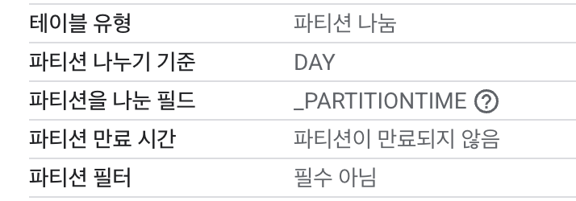
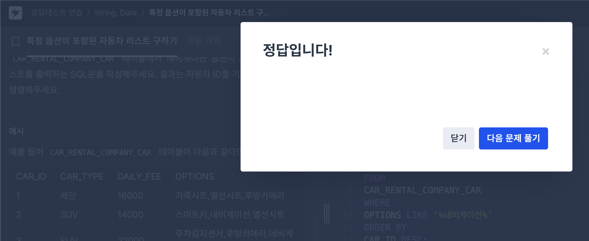
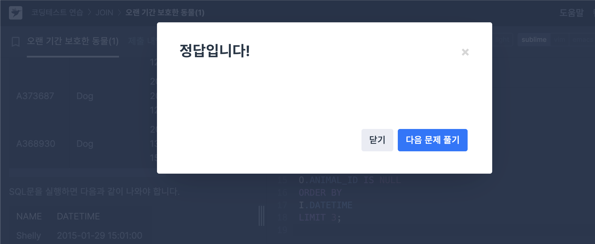

# SQL_BASIC 3주차 정규 과제 

📌SQL_BASIC 정규과제는 매주 정해진 분량의 `초보자를 위한 BigQuery(SQL) 입문` 강의를 듣고 간단한 문제를 풀면서 학습하는 것입니다. 이번주는 아래의 **SQL_Basic_3rd_TIL**에 나열된 분량을 수강하고 `학습 목표`에 맞게 공부하시면 됩니다.

**3주차 과제는 문제 풀이를 중심으로**, 강의에서 제시된 예제 문제 중 **7 문제 이상을 선택하여 직접 풀어본 뒤**, 강의 영상의 풀이와 비교해 **틀린 부분, 맞은 부분, 새롭게 배운 개념**을 구체적으로 정리해주세요. (적어도 3문제는 정리해야 합니다.) 완성된 과제는 Gihub에 업로드하고, 링크를 스프레드시트 'SQL' 시트에 입력해 제출해주세요.

**(수행 인증샷은 필수입니다.)** 

## SQL_BASIC_3rd

### 섹션 3. 데이터 탐색 - 조건, 추출, 요약

### 2-6. 연습문제 1~3번

### 2-6. 연습문제 7~9번

### 2-6. 연습문제 10~12번

### 2-6. 연습문제 13~17번

### 2-7. 정리 

### 2-8. 새로운 집계함수


## 섹션 4. 쿼리 잘 작성하기, 쿼리 작성 템플릿 및 오류를 잘 디버깅하기

### 3-1. INTRO

### 3-2. SQL 쿼리 작성하는 흐름

### 3-3. 쿼리 작성 템플릿과 생산성 도구 


## 🏁 강의 수강 (Study Schedule)

| 주차  | 공부 범위              | 완료 여부 |
| ----- | ---------------------- | --------- |
| 1주차 | 섹션 **1-1** ~ **2-2** | ✅         |
| 2주차 | 섹션 **2-3** ~ **2-5** | ✅         |
| 3주차 | 섹션 **2-6** ~ **3-3** | ✅         |
| 4주차 | 섹션 **3-4** ~ **4-4** | 🍽️         |
| 5주차 | 섹션 **4-4** ~ **4-9** | 🍽️         |
| 6주차 | 섹션 **5-1** ~ **5-7** | 🍽️         |
| 7주차 | 섹션 **6-1** ~ **6-6** | 🍽️         |

<br>

<!-- 여기까진 그대로 둬 주세요-->

---

# 1️⃣ 개념정리

## 2-6. 연습문제

~~~
✅ 학습 목표 :
* 연습문제(7문제 이상) 푼 것들 정리하기
~~~

> 💡**쿼리 작성 팁**
>>- 조건?
>>- 어떤 테이블?
>>- 어떤 컬럼?
>>- 어떻게 집계?

# NULL 
- 아무것도 없는 값. 존재하지 않음.
- 다른 값과 비교할 수 없음. (= NULL 과 같은 연산 불가)
- IS 연산자를 사용함.

# 1. 포켓몬 중에 type2가 없는 포켓몬의 수를 작성하는 쿼리를 작성해주세요.

```sql
SELECT 
  COUNT(id)
FROM `assignment-sql-471416.basic.pokemon` 
WHERE 
  type2 IS NULL
```
추가 설명) 
1. `COUNT(id) AS cnt` : 별칭 지정해주어 쿼리 결과의 의미 파악을 더 쉽게함. 실무에서는 거의 필수적으로 사용하는 것이 좋음. (가독성, 유지보수성, 다른 시스템과의 연동성 향상)

2. `AND` 조건 : WHERE 절에서 여러 조건을 연결하고 싶은 경우 사용.

3. `OR` 조건 : `() OR ()` 양식으로 사용.

의문점)

Q. 키워드 작성 시에 대문자로 쓰는 이유가 따로 있을까? 소문자로 쓰면 안 되나?

A. 소문자로 써도 정상적으로 작동되긴 한다. 하지만 주로 **가독성**과 **관례** 때문에 대문자로 작성한다. 즉, 명령어와 테이블/컬럼명을 시각적으로 쉽게 구분할 수 있다. 예시) `SELECT type1 FROM pokemon`은 `select type1 from pokemon` 보다 키워드가 훨씬 눈에 잘 들어옴. 


# 2. type2가 없는 포켓몬의 type1과 type1의 포켓몬 수를 알려주는 쿼리를 작성해주세요. 단, type1의 포켓몬 수가 큰 순으로 정렬해주세요.

```sql
SELECT
  type1,
--   에러메시지 -> GROUP BY 추가.
  COUNT(id) AS cnt
FROM `basic.pokemon`
WHERE 
  type2 IS NULL
GROUP BY
  type1
ORDER BY descending 
-- 문법 오류 -> ORDER BY cnt(정렬할 대상) DESC 로 써야함.
```

오류설명)

- `Syntax error: Expected end of input but got keyword SELECT at [13:1]`: 한 쿼리에 여러 쿼리문이 있을 때, 하나의 쿼리문이 끝났다면 끝에 `;`붙여줘야해!
- `Query error: SELECT list expression references column type1 which is neither grouped nor aggregated at [14:3]`: 집계함수는 GROUP BY와 같이 다님. 집계하는 기준(컬럼)이 없다면 COUNT만 쓸 수 있으나, 집계 기준이 있다면 그 기준 컬럼을 GROUP BY에 써주어야 함. 


# 3. type2 상관없이 type1의 포켓몬 수를 알 수 있는 쿼리를 작성해주세요.
```sql
select 
  type1,
  count(id) as cnt 
--   count(distinct id)를 쓸 수도 있음. 추가 설명 참고.
from basic.pokemon
group by type1
```
추가설명)
- `DISTINCT`는 고유값만 보고 싶을 때 사용한다. unique 한 값만 알고 싶은 경우 사용.
- `COUNT(id)` = `COUNT(DISTINCT id)`
- id 설계시에 중복이 없도록 설계했기 때문에 위 두 결과 동일함.
- 어떤 컬럼은 중복이 있게 설계되곤 함.
- `DISTINCT` 를 써보고, 어떤 값이 더 맞을지 판단!
- 대표적인 예시) `COUNT (DISTINCT user_id) AS dau`: daily active user;active 한 유저의 수를 하루 단위로 집계. => 이런 데이터를 저장하는 곳에 접속 기록, 이벤트 로그 등이 여러 row가 존재함. 

#4. 전설 여부에 따른 포켓몬 수를 알 수 있는 쿼리를 작성해주세요.
```sql
select
  is_legendary,
  count(id) as cnt
from basic.pokemon
group by is_legendary
````
> 💡tip!
>> - `GROUP BY` 에 여러 컬럼을 쓸 경우가 생김. 
>> - `GROUP BY 1` 은 `SELECT`의 첫 컬럼을 의미! (select 에 집계함수가 들어간 경우엔 오류.) 
>> -  `ORDER BY` 에도 적용됨. 
>> - 쿼리를 빠르게 작성하고, 결과를 보는 과정에서 유용함. 하지만 완성된 쿼리문에서는 명확하게 컬럼을 명시하는 것이 좋음(for **가독성**).


# 5. 동명이인이 있는 이름은 무엇일까요?

<where 절 없이>
```sql
select
  name,
  count(name) as trainer_cnt
from basic.trainer
-- where
--     count(name) >= 2
group by name
having
    trainer_cnt >=2
```
오류 설명) 
- `Aggregate function COUNT not allowed in WHERE clause at [7:3]` : `WHERE` 절은 개별 행(row)에 대한 조건을 필터링 하는 데에 사용함. 반면, 집계함수는 `GROUP BY` 절로 그룹화된 결과에 대해 계산을 수행함. => `WHERE` 절에서 `COUNT(name)`과 같이 그룹화된 결과를 바로 필터링할 수 없다. 

<where 절 사용>
```sql
select
  *
from(
  select
    name,
    count(name) as cnt_name
  from basic.trainer
  group by name
)
where
  cnt_name >= 2
```


> 💡REMIND!
>> - 집계 후 조건 => `HAVING` , FROM 절의 테이블 조건 => `WHERE`
    >>      - `WHERE`: 원본 데이터 FROM 절에 있는 데이터에 조건을 설정하고 싶은 경우
    >>      - `HAVING`: GROUP BY 와 함께 집계 결과에 조건을 설정하고 싶은 경우    
>> - **서브쿼리** 
    >> 쿼리문을 한 번 감싸서 다른 쿼리문에서 사용할 수 있음. (복잡해질 수 있기 때문에 잘 생각해서 써라~)
    

# 7. trainer 테이블에서 "Iris", "Whitney", "Cynthia" 트레이너의 정보를 알 수 있는 쿼리를 작성해주세요. 
```sql
select
  *
from basic.trainer
where 
    name IN ("Iris", "Whitney", "Cynthia")
--   name = "Iris" 
--   or name = "Whitney" 
--   or name = "Cynthia" 
```
>💡팁!
>> `ÀND` 조건과 `OR` 조건이 많아지면 혼동될 수 있으니, () 쳐줄 것! 예) `(name = "Iris") or (name = "Whitney") or (name = "Cynthia")`

# IN
- `column_name IN (value)` : 컬럼에 괄호 안의 value가 있는 row 만 추출. 


# 11. type2가 있는 포켓몬 중에 제일 많은 type1은 무엇인가요?

```sql
select
  type1, 
  count(id) as cnt
from basic.pokemon
where type2 is not null
group by type1
order by cnt DESC
limit 1
-- limit을 사용해 보여주는 행의 개수 제한!
```

# 13. 포켓몬의 이름에 "파"가 들어가는 포케몬은 어떤 포켓몬일까?
```sql
select
  kor_name
from basic.pokemon
where kor_name like "%파%"
```

# LIKE
- `컬럼 LIKE "특정단어%"`
- "%파" : 파로 끝나는 단어, "파%" : 파로 시작하는 단어, "%파%" : 파가 들어간 단어.
- 문자열 컬럼에서 특정 단어가 포함되어 있는지 알고 싶은 경우에 `LIKE` 사용. 

# 17. 트레이너 별로 풀어준 포켓몬의 비율의 20%가 넘는 포켓몬 트레이너?
```sql
select
  trainer_id, 
  countif(status = "Released") AS released_cnt, 
  count(pokemon_id) AS pokemon_cnt,
  countif(status = "Released")/count(pokemon_id) AS released_ratio
from basic.trainer_pokemon
group by trainer_id
having released_ratio >=0.2
```
# COUNTIF
- 특정 컬럼의 상태 등을 조건을 걸어 집계. 


# 지금까지 배운 내용 총정리



## 2-8. 새로운 집계함수

~~~
✅ 학습 목표 :
* SQL 쿼리 구조를 이해할 수 있다. 
* SELECT, FROM, WHERE을 활용하는 방법을 설명할 수 있다. 
~~~

# GROUP BY ALL
- select 절에 명시한 컬럼을 일일이 쓰지 않고 한 번에 작성할 수 있음. 

```sql
select 
    firstname as first_n,
    lastname as last_n
    sum(PointsScored) as total_points
from PlayerStats
group by all
-- firstname 과 lastname으로 group by
```


## 3-2. 쿼리를 작성하는 흐름

~~~
✅ 학습 목표 :
* 쿼리를 작성하는 흐름을 설명할 수 있다.
~~~

# 쿼리를 작성하는 흐름
1. 지표 고민 : 어떤 문제를 해결하기 위해 데이터가 필요하지?
2. 지표 구체화 : 구체적인 지표를 명시해야함.
3. 지표 탐색 : 유사한 문제를 해결한 케이스가 있나 확인 -> 해당 쿼리 리뷰 / 없다면? -> 4.
4. 쿼리 작성 : 테이블 찾기  
    - 1개
    - 2개 이상 : 연결 방법 고민 `JOIN`
5. 데이터 정합성 확인 : 예상 결과와 동일한지 확인
6. 쿼리 가독성 : 나중을 위해 깔끔한 쿼리 작성
7. 쿼리 저장 : 재사용 되기 때문에 문서로 저장함.


## 3-3. 쿼리 작성 템플릿과 생산성 도구

~~~
✅ 학습 목표 :
* 생산성 도구를 만들 수 있다.
~~~

# 쿼리 작성 템플릿
- 쿼리를 작성하는 목표, 확인할 지표 정의
- 쿼리 계산 방법
- 데이터의 기간 : 데이터가 너무 많으면 비용과 속도 측면에서 좋지 않음. 
- 사용할 테이블
- join KEY
- 데이터 특징

=> 템플릿 사용 습관을 형성하기 위해 **생산성 도구** 를 활용
[Espanso](https://espanso.org/)

- 터미널 -> `espanso edit` -> control+x -> 저장하고 나가기 

- vs code에서 편집하는 방법: 터미널 -> `code ~/Library/Application\ Support/espanso` 입력 -> 편집


<br>
<br>

---

# 2️⃣ 학습 인증란






<br><br>


---

# 3️⃣ 확인문제

## 문제 1

> **🧚Q. 포켓몬 게임에 재미를 느낀 동혁은 포켓몬 도감에서 강력한 포켓몬 타입을 미리 선점하기 위해, 먼저 어떤 포켓몬들이 있는지 포켓몬 수를 기준으로 내림차순 정렬하여  확인하고자 했습니다.**
>
> 그래서 다음과 같은 필요한 정보를 미리 정리해보았습니다. 

~~~
조건 : type2는 상관없이
보고 싶은 컬럼 : type1
집계 내용 : 각 type1 별 포켓몬 수
정렬 기준 : 포켓몬 수를 기준으로 내림차순 정렬
~~~

> **이 목표를 바탕으로 동혁이 아래와 같은 쿼리를 잘 작성했지만, 일부 SQL 문법 요소를 빼먹었습니다. 비어 있는 부분인 ㄱ,ㄴ,ㄷ 에 들어갈 알맞은 SQL 구문을 채워보세요:**

~~~sql
SELECT type1, (ㄱ)
FROM pokemon
(ㄴ) type1
ORDER BY (ㄱ) (ㄷ);
~~~


~~~
(ㄱ): COUNT(id) AS pokemon_cnt
(ㄴ): GROUP BY
(ㄷ): DESC
~~~


### 🎉 수고하셨습니다.
