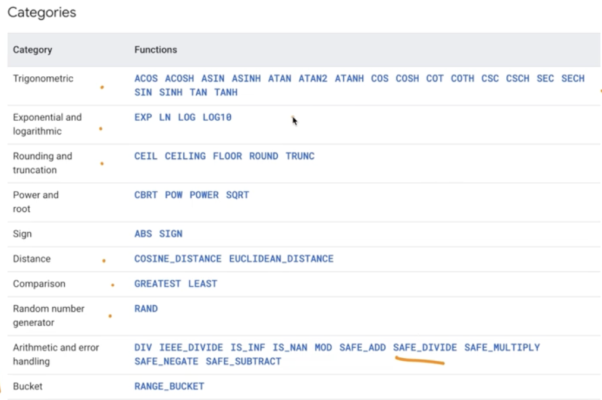
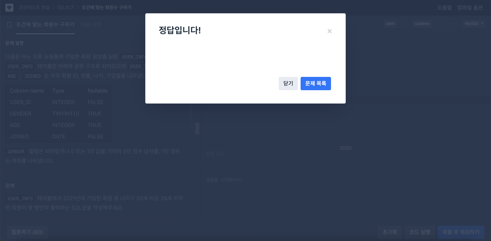

# SQL_BASIC 4주차 정규 과제 

📌SQL_BASIC 정규과제는 매주 정해진 분량의 `초보자를 위한 BigQuery(SQL) 입문` 강의를 듣고 간단한 문제를 풀면서 학습하는 것입니다. 이번주는 아래의 **SQL_Basic_4th_TIL**에 나열된 분량을 수강하고 `학습 목표`에 맞게 공부하시면 됩니다.

**4주차 과제부터는 강의 내용을 정리하는 것과 함께, 프로그래머스에서 제공하는 SQL 문제를 직접 풀어보는 실습도 병행합니다.** 강의에서는 **배운 내용을 정리하고 주요 쿼리 예제를 정리**하며, 프로그래머스 문제는 **직접 풀어본 뒤 풀이 과정과 결과, 배운 점을 함께 기록**해주세요. 완성된 과제는 Github에 업로드하고, 링크를 스프레드시트 'SQL' 시트에 입력해 제출해주세요.

**(수행 인증샷은 필수입니다.)** 

## SQL_BASIC_4th

### 섹션 4. 쿼리 잘 작성하기, 쿼리 작성 템플릿 및 오류를 잘 디버깅하기

### 3-4. 오류를 잘 디버깅하는 방법


## 섹션 5. 데이터 탐색 - 변환

### 4-1. INTRO

### 4-2. 데이터 타입과 데이터 변환(CAST, SAFE_CAST)

### 4-3. 문자열 함수(CONCAT, SPLIT, REPLACE, TRIM, UPPER)

### 4-4. 날짜 및 시간 데이터 이해하기(1) (타임존, UTC, Millisecond, TIMESTAMP/DATETIME)


## 🏁 강의 수강 (Study Schedule)

| 주차  | 공부 범위              | 완료 여부 |
| ----- | ---------------------- | --------- |
| 1주차 | 섹션 **1-1** ~ **2-2** | ✅         |
| 2주차 | 섹션 **2-3** ~ **2-5** | ✅         |
| 3주차 | 섹션 **2-6** ~ **3-3** | ✅         |
| 4주차 | 섹션 **3-4** ~ **4-4** | ✅         |
| 5주차 | 섹션 **4-4** ~ **4-9** | 🍽️         |
| 6주차 | 섹션 **5-1** ~ **5-7** | 🍽️         |
| 7주차 | 섹션 **6-1** ~ **6-6** | 🍽️         |

<br>

<!-- 여기까진 그대로 둬 주세요-->

---

# 1️⃣ 개념정리

## 3-4. 오류를 디버깅하는 방법

~~~
✅ 학습 목표 :
* 오류의 정의에 대해 설명할 수 있다. 
* 오류 메시지를 보고 디버깅이라는 과정을 수행할 수 있다. 
~~~

<!-- 새롭게 배운 내용을 자유롭게 정리해주세요.-->

☑️ 오류
- syntax error : 문법을 지키지 않아 생기는 오류
  - 예) `Syntax error: SELECT list must not be empty at [9:1]` 
  - 예) `Number of arguments does not match for aggregate function COUNT` -> count 의 인자수는 1개 여야 함. 
- 오류메시지가 뜨면, 검색 후 오류 수정하면 돼~ (빨간줄 그어진 부분 중심으로 봐바)


## 4-2. 데이터 타입과 데이터 변환(CAST, SAFE_CAST)

~~~
✅ 학습 목표 :
* 데이터 타입의 종류를 설명할 수 있다. 
* 데이터 타입을 변환하는 방법을 설명할 수 있다. 
~~~

### 데이터 변환
☑️ 데이터 타입
- 숫자 : 실수
- 문자 : "나"
- 시간, 날짜 : 2024-01-01
- 부울(bool) : 참/거짓
  - 보이는 것과 저장된 것의 차이가 존재하기 때문에 데이터 타입에 대해 잘 알아야 함. 

## ☑️ `CAST`
- 자료 타입 변경하는 함수
- `cast(1 as string)`
## ☑️ `SAFE_CAST`
- 변환이 실패할 경우 NULL 반환
- `cast("함수" as int64)` -> `NULL`
- `SAFE_DIVIDE`로도 쓸 수 있다!
## ☑️ 수학함수 _ 암기 할 필요 없음



## 4-3. 문자열 함수(CONCAT, SPLIT, REPLACE, TRIM, UPPER)

~~~
✅ 학습 목표 :
* 문자열 함수들의 종류를 이해하고 어떠한 상황에서 사용하는지 설명할 수 있다. 
~~~

## ☑️ `CONCAT` : 문자열 붙이기
- 인자로 string 이나 숫자를 넣을 땐 데이터를 직접 넣어준 것임 -> `FROM` 없어도 실행가능
```sql
select
  concat("안녕", "하세요") as result
```

## ☑️ `SPLIT` : 문자열 분리하기
- `split(문자열원본, 나눌 기준이 되는 문자)`
```sql
select
  split("가,나,다,라", ",") as result;
```
- 결과는 배열!

## ☑️ `REPLACE`: 특정 단어 수정하기
- `replace(문자열원본, 찾을 단어, 바꿀 단어)`
```sql
select
  replace("안녕하세요", "안녕","실천") as result
```

## ☑️ `TRIM`: 문자열 자르기
- `trim(문자열원본, 자를 단어)`
```sql
select
  trim("안녕하세요", "안녕") as result
```

## ☑️ `UPPER`: 소문자를 대문자로 변경
- `upper(문자열원본)`
```sql
select
  upper("abc") as result
```


## 4-4. 날짜 및 시간 데이터 이해하기(1) (타임존, UTC, Millisecond, TIMESTAMP/DATETIME)

~~~
✅ 학습 목표 :
* 날짜 및 시간 데이터 타입과 UTC의 개념을 설명할 수 있다. 
* DATE, DATETIME, TIMESTAMP 에 대해서 설명할 수 있다.
* 시간함수들의 종류와 시간의 차이를 추출하는 방법을 설명할 수 있다. 
~~~

# 날짜 및 시간 데이터 
- 시간 
   - `created_at`: 언제 이 컬럼이 생성되었는가
   - `updated_at`: 언제 이 컬럼이 변경되었는가
   - 'user'가 어떤 행위를 하는 것은 '시간의 흐름'에 따름 
   - 개발에서의 시간은 일반적인 시간과 개념이 다르기 때문에 잘 이해해야함 

## 핵심
- 데이터 타입 파악: DATE, DATETIME, TIMESTAMP
- 알면 좋은 개념: UTC, Millisecond
- 날짜 및 시간 데이터의 타입 변환
- 시간 관련 함수(두 시간의 차이, 특정 부분 추출)

## 시간 데이터 
☑️ DATE : DATE만 표시하는 데이터 (eg. 2025-10-31)

☑️ DATETIME : DATE + TIME 표시하는 데이터, time zone 정보 없음 (eg. 2025-10-31 22:23:00)

☑️ TIME : TIME만 표시하는 데이터 (eg. 22:23:00)

‼️**TIME ZONE**‼️
- GMT : 그리니치 천문대 기준 시간 (eg. 한국시간 : GMT +9)
- **UTC**(universal time coordinated): 국제적인 표준 시간, 타임존이 존재한다=특정 지역의 표준 시간대 (eg. 한국시간 : UTC +9)
- TIMESTAMP : UTC로부터 경과한 시간, timezone 정보 있음.

☑️ Millisecond, microsecond
- **millisecond**
  - 천분의 1초(1,000ms = 1s)
  - 빠른 반응이 필요한 분야에서 사용
  - Millisecond -> TIMESTAMP -> DATETIME으로 변경을 많이 함.

- microsecond
  - 1,000,000초 분의 1

```sql
select
  timestamp_millis(1704176819711) as milli_to_timestamp,
  timestamp_micros(1704176819711000) as micro_to_timestamp,
  datetime(timestamp_micros(1704176819711000)) as datetime,
  datetime(timestamp_micros(1704176819711000), 'Asia/Seoul') as datetime_asia
```
| 행 | milli_to_timestamp           | micro_to_timestamp           | datetime                  | datetime_asia              |
|----|------------------------------|------------------------------|---------------------------|----------------------------|
| 1  | 2024-01-02 06:26:59.711000 UTC | 2024-01-02 06:26:59.711000 UTC | 2024-01-02T06:26:59.711000 | 2024-01-02T15:26:59.711000 |
|   | timestamp | timestamp | datetime | datetime |

- ‼️**UTC 항상 체크 !!**


## TIMESTAMP vs DATETIME
```sql
select
  current_timestamp() as timestamp_col,
  datetime(current_timestamp(), 'Asia/Seoul') as datetime_col
```
| timestamp_col                  | datetime_col              |
|--------------------------------|---------------------------|
| 2025-09-28 15:34:48.216034 UTC | 2025-09-29T00:34:48.216034 |
| UTC 라고 나옴 | T 라고 나옴|
|한국시간-9시간| 한국시간과 동일|


<br>

<br>

---

# 2️⃣ 확인문제 & 문제 인증

## 프로그래머스 문제 

> 조건에 맞는 회원 수 구하기 (SELECT, COUNT) 
>
> **먼저 문제를 풀고 난 이후에 확인 문제를 확인해주세요**
>
> 문제 링크 
>
> :  https://school.programmers.co.kr/learn/courses/30/lessons/131535#

<!-- 문제를 풀기 위하여 로그인이  필요합니다. -->




## 문제 1

> **🧚Q. 프로그래머스 문제를 풀던 서현이는 여러 번의 시행착오 끝에 결국 혼자 해결하기 어려워 오류 메시지를 공유하며 도움을 요청했습니다. 여러분들이 오류 메시지를 확인하고, 해당 SQL 쿼리에서 어떤 부분이 잘못되었는지 오류 메시지를 해석하고 찾아 설명해주세요.**

~~~sql
# 조건에 맞는 회원 수 구하기 (SELECT, COUNT) 
# 서현이의 SQL 첫 번째 풀이
SELECT COUNT(AGE, JOINED)
FROM USER_INFO
WHERE AGE BETWEEN 20 AND 29
  AND JOINED BETWEEN '2021-01-01' AND '2021-12-31';
  
오류 메시지 : Error: Number of arguments does not match for aggregate function COUNT
 
# 수정하고 난 이후 두 번째 풀이
SELECT AGE, COUNT(*)
FROM USER_INFO
WHERE AGE BETWEEN 20 AND 29
  AND JOINED BETWEEN '2021-01-01' AND '2021-12-31';
  
오류 메시지 : SELECT list expression references column AGE which is neither grouped nor aggregated
~~~


~~~
Error: Number of arguments does not match for aggregate function COUNT 
-> count 함수의 인자수는 1개여야한다. 위 커리문에서는 2개가 들어가 있기 때문에 오류가 났다. 

SELECT list expression references column AGE which is neither grouped nor aggregated
-> select 절에 오는 컬럼들은 group by 절에 포함되거나, 집계함수로 감싸져 있어야 한다. 위 커리문에서는 "GROUP BY AGE" 를 쓰지 않았기 때문에 오류가 났다. 
~~~


### 🎉 수고하셨습니다.
