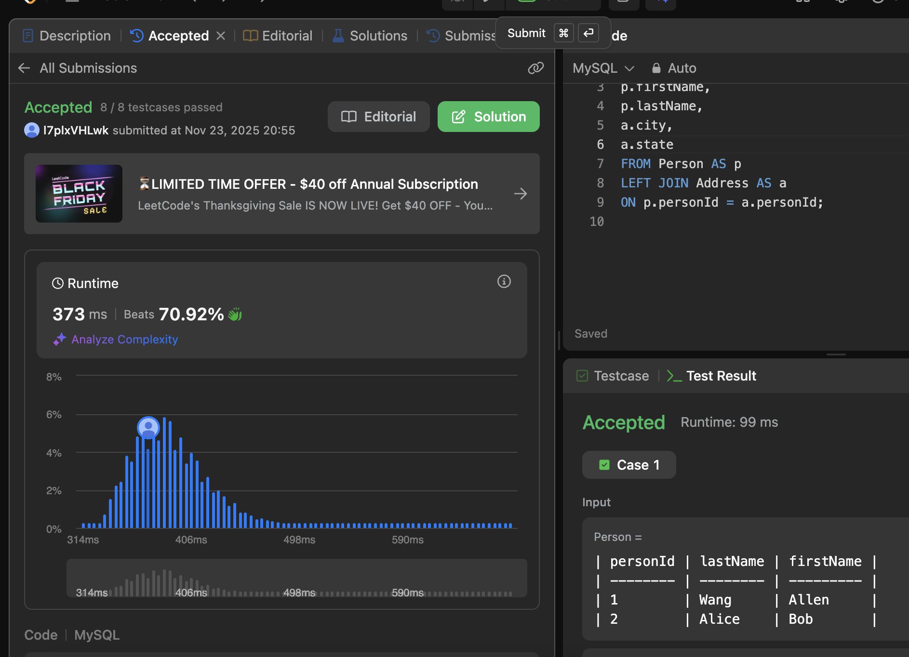

# SQL_BASIC 5주차 정규 과제 

📌SQL_BASIC 정규과제는 매주 정해진 분량의 `초보자를 위한 BigQuery(SQL) 입문` 강의를 듣고 간단한 문제를 풀면서 학습하는 것입니다. 이번주는 아래의 **SQL_Basic_5th_TIL**에 나열된 분량을 수강하고 `학습 목표`에 맞게 공부하시면 됩니다.

**5주차 과제는 문제 풀이를 중심으로**, 강의에서 제시된 예제 문제 중 **3 문제 이상을 선택하여 직접 풀어본 뒤**, 강의 영상의 풀이와 비교해 **틀린 부분, 맞은 부분, 새롭게 배운 개념**을 구체적으로 정리해주세요. (적어도 4문제는 정리해야 합니다.) 완성된 과제는 Gihub에 업로드하고, 링크를 스프레드시트 'SQL' 시트에 입력해 제출해주세요.

**(수행 인증샷은 필수입니다.)** 


## SQL_BASIC_5th

### 섹션 5. 데이터 탐색 - 변환

### 4-4. 날짜 및 시간 데이터 이해하기(2) (EXTRACT, DATETIME_TRUNC, PARSE_DATETIME, FROMAT_DATETIME)

### 4-5. 시간 데이터 연습문제 1~2번

### 4-5. 시간 데이터 연습문제 3~5번

### 4-6. 조건문 (CASE WHEN, IF)

### 4-7. 조건문 연습 문제

### 4-8. 정리

### 4-9. BigQuery 공식 문서 확인하는 법

(강의에서 연습문제가 많아서 따로 프로그래머스 문제 과제는 없습니다.)


## 🏁 강의 수강 (Study Schedule)

| 주차  | 공부 범위              | 완료 여부 |
| ----- | ---------------------- | --------- |
| 1주차 | 섹션 **1-1** ~ **2-2** | ✅         |
| 2주차 | 섹션 **2-3** ~ **2-5** | ✅         |
| 3주차 | 섹션 **2-6** ~ **3-3** | ✅         |
| 4주차 | 섹션 **3-4** ~ **4-4** | ✅         |
| 5주차 | 섹션 **4-4** ~ **4-9** | ✅         |
| 6주차 | 섹션 **5-1** ~ **5-7** | 🍽️         |
| 7주차 | 섹션 **6-1** ~ **6-6** | 🍽️         |

<br>


<!-- 여기까진 그대로 둬 주세요-->

---

# 4-4. 날짜 및 시간 데이터 이해하기(2) (EXTRACT, DATETIME_TRUNC, PARSE_DATETIME, FROMAT_DATETIME)

~~~
✅ 학습 목표 :
* 날짜 및 시간 데이터에 대해서 더 자세히 설명할 수 있다. 
* CURRENT_TIME, EXTRACT, DATETIME_TRUNC, PARSE_DATETIME, FROMAT_DATETIME 을 설명할 수 있다. 
~~~

# DATETIME 함수
## `CURRENT_DATETIME([타임존 정보])` : 현재 DATETIME 출력

```sql
select
  current_date() as current_date,
  current_date("Asia/Seoul") as asia_date,
  current_datetime() as current_datetime,
  current_datetime("Asia/Seoul") as current_datetiem_asia;
```
-> 
| current_date | asia_date  | current_datetime           | current_datetime_asia      |
|---------------|------------|----------------------------|-----------------------------|
| 2025-11-02    | 2025-11-02 | 2025-11-02T06:38:52.217709 | 2025-11-02T15:38:52.217709 |

> **주의할 점** 
>> 타임존 정보를 빼먹으면 회사에서 작업할 때 혼동을 줄 수 있음! 

## `EXTRACT`: DATETIME에서 특정 부분(연도, 일, 월, 초 등)만 추출하고 싶은 경우
- 일자별 주문, 월별 주문별로 보고 싶을 때 유용!
- [extract 공식 문서](https://cloud.google.com/bigquery/docs/reference/standard-sql/datetime_functions#extract)

- 요일을 추출하고 싶은 경우
   - `extract(DAYOFWEEK FROM datetime_col)`: 한 주의 첫날이 일요일인 [1,7]범위의 값 변환
```sql
select
extract(DAYOFWEEK FROM DATETIME "2025-11-02 16:19:00") as day_of_sun;
```
-> 1

## `DATETIME_TRUNC`: date와 hour만 남기고 싶은 경우; 시간 자르기
- 일자별로 시간대별 수요를 구하고 싶을 때 등 쓰임
- [datetime_truc 공식문서](https://cloud.google.com/bigquery/docs/reference/standard-sql/datetime_functions#datetime_trunc)
```sql
select
  datetime_trunc(DATETIME "2025-11-02 16:19:00", DAY) as day_truc,
  datetime_trunc(DATETIME "2025-11-02 16:19:00", MONTH) as month_truc,
  datetime_trunc(DATETIME "2025-11-02 16:19:00", HOUR) as hour_truc;
```
->
| day_truc             | month_truc           | hour_truc            |
|-----------------------|----------------------|----------------------|
| 2025-11-02T00:00:00  | 2025-11-01T00:00:00  | 2025-11-02T16:00:00  |

- 잘린 부분: 시간은 다 0으로 바뀜/날짜는 다 1로 바뀜 => 자른 후 나올 수 있는 제일 작은 값으로 바뀜!
- 보통 "hour" 자를 때 많이 씀. 
- 뒤에 나오는 숫자들이 헷갈릴 수 있으니 `extract`와 자유자재로 쓸 것

## `PARSE_DATETIME('문자열의 형태', 'DATETIME 문자열')`: '문자열'의 datetime ->  'DATETIME 타입'
```sql
select
  parse_datetime('%Y-%m-%d %H:%M:%S', '2025-11-02 16:36:12') as parse_dt;
```
-> 
| parse_dt |
|------------|
|2025-11-02T16:36:12|

- "parsing한다" = 문자열을 분석해서 알맞은 곳으로 배치한다
- [형식 참고](https://cloud.google.com/bigquery/docs/reference/standard-sql/format-elements#format_elements_date_time)


## `FROMAT_DATETIME` : 'DATETIME 타입' -> '문자열'
```sql
select
  format_datetime("%c", DATETIME "2025-11-02 16:36:12") as formatted;
```
->
| formatted |
|------------|
|Sun Nov  2 16:36:12 2025| 


## `LAST_DAY`: 마지막 날을 알고 싶은 경우; 자동으로 월의 마지막 값을 계산해서 특정 연산을 할 경우
```sql
SELECT
  LAST_DAY(DATETIME '2025-11-02 15:45:00') AS last_day,
  LAST_DAY(DATETIME '2025-11-02 15:45:00', MONTH) AS last_day_month,
  LAST_DAY(DATETIME '2025-11-02 15:45:00', WEEK) AS last_day_week, ##첫날 기준을 일요일로
  LAST_DAY(DATETIME '2025-11-02 15:45:00', WEEK(SUNDAY)) AS last_day_week_sun, ##첫날 기준을 일요일로
  LAST_DAY(DATETIME '2025-11-02 15:45:00', WEEK(MONDAY)) AS last_day_week_mon; ##첫날기준을 월요일로
```
->
| last_day | last_day_month | last_day_week | last_day_week_sun | last_day_week_mon |
|-----------|----------------|---------------|-------------------|-------------------|
| 2025-11-30 | 2025-11-30 | 2025-11-08 | 2025-11-08 | 2025-11-02 |

- 보통 첫날기준을 일요일로 함. 
- LAST_DAY 함수는 'month'기준을 많이 씀!

## `DATETIME_DIFF(DT1, DT2, 궁금한 차이)` : 두 datetime의 차이를 알고 싶은 경우
```sql
SELECT
  DATETIME_DIFF(DATETIME '2025-11-02 15:30:00', DATETIME '2025-11-01 15:30:00', DAY) AS diff_days,
  DATETIME_DIFF(DATETIME '2025-11-02 15:30:00', DATETIME '2025-11-01 15:30:00', HOUR) AS diff_hours,
  DATETIME_DIFF(DATETIME '2025-11-02 15:30:00', DATETIME '2025-11-01 15:30:00', MINUTE) AS diff_minutes;
```
-> 
| diff_days | diff_hours | diff_minutes |
| --------- | ---------- | ------------ |
| 1         | 24         | 1440         |


**위의 함수들은 DATETIME 뿐만 아니라 TIMESTAMP, DATE에도 적용 가능**

 

# 4-6. 조건문(CASE WHEN, IF)

~~~
✅ 학습 목표 :
* 조건문 함수의 기능을 이해하고, 설명할 수 있다. 
~~~

# 조건문
- 특정 조건이 참이면 A, 아니면 B
- 조건에 따른 분기 처리가 필요한 경우
- 조건에 따라 다른 값을 표시하고 싶을 때 사용((컬럼값 변환, 등등)
- 방법: CASE WHEN, IF
- 사용하는 이유: 특정 카테고리를 **하나로 합치는** 전처리가 필요할 수 있음
   - 데이터를 저장하는 쪽과 분석하는 쪽이 나뉨.

## CASE WHEN : 여러 조건 있을 경우 사용, 순서 유의
1. 문법
```sql
SELECT CASE 
   WHEN(조건 1) THEN (조건 1 참일 때 결과)
   WHEN(조건 2) THEN (조건 2 참일 때 결과) 
   ELSE (그 외 결과) 
END AS (새로 만들 컬럼명)
``` 
2. 예시: 포켓몬 데이터에서 바위와 땅 타입을 하나로 하면?
```sql
SELECT 
  new_type,
  COUNT(DISTINCT id) AS cnt
FROM(
  SELECT
    *,
    CASE
      WHEN (type1 IN ("Rock","Ground")) OR (type2 IN ("Rock","Ground")) THEN "ROCK&GROUND"
  ELSE type1
  END AS new_type
FROM `basic.pokemon`
)
GROUP BY new_type;
```
3. 주의할 점 
- **순서**
  - row 기준으로 처리됨. 첫째 조건문에서 먼저 걸러짐.
  - 조건 1, 2 둘 다 해당하면 앞선 순서(조건1)을 따르기 때문에 주의해야됨
  - 문자열 함수(특정단어추출)에서 이슈가 자주 발생

## IF : 단일 조건일 경우 유용
1. 문법
```sql
SELECT 
  IF(조건문, true일 때 값, false일 때 값) AS (새로운 컬럼명)
``` 


 # 4-5. 시간 데이터 연습문제 & 4-7. 조건문 연습 문제

~~~
✅ 학습 목표 :
* 4-5, 4-7 각각에서 두 문제 이상 (최소 4문제) 푼 내용 정리하기
~~~

## 4-5
### 1번. 트레이너가 포켓몬을 포획한 날짜(catch_date)를 기준으로, 2023년 1월에 포획한 포켓몬의 수를 계산해주세요.
```sql
SELECT
  COUNT(DISTINCT id) AS cnt
FROM basic.trainer_pokemon
WHERE
  EXTRACT(YEAR FROM DATETIME(catch_datetime, "Asia/Seoul")) = 2023 # catch_datetime은 TIMESTAMP로 저장되어 있으므로, DATETIME으로 변경해야 함
  AND EXTRACT(MONTH FROM DATETIME(catch_datetime, "Asia/Seoul")) = 1
```
-> 85

<**주의사항1**>
- catch_date : DATE 타입
- catch_datetime : UTC. TIMESTAMP 타입 => 컬럼의 이름은 datetime인데 TIMESTAMP 타입으로 저장되어 있다!
   - 컬럼 이름만 믿고 바로 쿼리를 작성하면 안 됨! 데이터를 꼭 확인해야해~~

<**🚨주의사항2**>
- catch_date 가 무슨 기준의 시간/날짜 데이터인지 명시되어있지 않다! 한국시간(kr)? UTC?
   - catch_date != DATE(DATETIME(catch_datetime, "Asia/Seoul")) => 있다면 catch_date는 사용하기 어려울 수 있다  <- 데이터를 저장하는 부분에서 이슈가 발생한 경우가 있음 
- 아래 처럼 검증 코드 작성해서 확인!
```sql
select
*
from(
select
  catch_date,
  date(datetime(catch_datetime, "Asia/Seoul")) as catch_datetime_kr
from
  basic.trainer_pokemon
)
where
  catch_date != catch_datetime_kr;
```
-> catch_date를 바로 쓸 수 없다! => catch_datetime 컬럼 사용!!

> 요청한 사람 또는 문제를 그대로 볼 경우 틀릴 수 있다. 컬럼을 꼭 파악하고(정의 확인) 쿼리를 작성할 것!!

### 2번. 배틀이 일어난 시간(battle_datetime)을 기준으로, 오전 6시에서 오후 6시 사이에 일어난 배틀의 수를 계산해주세요.

1. battle_datetime이랑 DATETIME(battle_timestamp, "Asia/Seoul")가 같은지 먼저 점검

방법1) 서브쿼리 <br>
SELECT * <br>
FROM( <br>
SELECT
  id,
  battle_datetime,
  DATETIME(battle_timestamp, "Asia/Seoul") AS battle_timestamp_kr <br>
FROM basic.battle) <br>
WHERE battle_datetime != battle_timestamp_kr;

방법2) <span style="color:red">COUNTIF 사용</span> <br>
SELECT
  <span style="color:red">COUNTIF</span>(battle_datetime != DATETIME(battle_timestamp, "Asia/Seoul"))
 AS T  <span style="color:green">#특정조건을 만족하는 셀의 개수</span> <br>
FROM basic.battle;

<br>

2. 풀이

SELECT COUNT(<span style="color:red">DISTINCT</span>id) as cnt <br>
FROM basic.battle <br>
WHERE EXTRACT(HOUR FROM battle_datetime) >= 6 AND EXTRACT(HOUR FROM battle_datetime) < 18 <br>

<span style="color:green">EXTRACT(HOUR FROM battle_datetime) BETWEEN 6 AND 18 <- 반복되는거 깔끔하게 줄이기 위해 </span>

3. 추가문제_ 시간대별로 몇 건이 있는가?

SELECT hour, COUNT(DISTINCT id) AS battle_cnt <br>
FROM (
  SELECT
    *,
    EXTRACT(HOUR FROM battle_datetime) AS hour
  FROM basic.battle
) <br>
GROUP BY
  hour <br>
ORDER BY
  hour


## 4-7
### 1번. 포켓몬의 'Speed'가 70 이상이면 '빠름', 그렇지 않으면 '느림'으로 표시하는 새로운 컬럼 'Speed_Category'를 만들어 주세요
1. 풀이

SELECT
  speed,
  IF(speed >= 70, '빠름', '느림') AS Speed_Category <br>
FROM basic.pokemon

2. 확인하면 좋을 것
- speed에 대한 데이터를 확인하는 것이므로, **speed min/max값을 확인해봄**으로써 데이터 파악하면 좋을듯.

### 3번. 각 포켓몬의 총점(total)을 기준으로, 300 이하면 'Low', 301에서 500 사이면 'Medium', 501 이상이면 'High'로 분류해주세요
1. 풀이
SELECT
  total, <br>
  CASE
    WHEN total <= 300 THEN "Low"
    WHEN total BETWEEN 301 and 500 THEN "Medium"
  ELSE "High"
  END AS total_1 <br>
FROM basic.pokemon

### 5번. 트레이너가 포켓몬을 포획한 날짜(catch_date)가 '2023-01-01' 이후이면 'Recent', 그렇지 않으면 'Old'로 분류해주세요.
1. 풀이
SELECT
  catch_datetime,
  IF(DATE(catch_datetime, "Asia/Seoul") >= "2023-01-01", "Recent", "Old") AS recent_or_old <br>
FROM `basic.trainer_pokemon`

2. 헷갈렸던 부분
- 날짜를 조건으로 걸 때, 그냥 무조건 'date'컬럼으로 하지말고 **time zone 확인**해서 할 것!!!


<학습 인증>




<br>

<br>


---

# 확인문제

## 문제 1

> **🧚Q. 광윤이는 사용자 로그 데이터에서, 2021년에 접속한 사용자 수를  집계하려고 했습니다. 그는 여러 SQL 쿼리들을 실행해봤지만, 그 중 일부는 문법적으로 잘못되어 실행되지 않았습니다. 다음 보기 중 틀린 쿼리를 모두 골라보세요 (복수 선택 가능)**

~~~sql
1. SELECT COUNT(*)  
   FROM user_log  
   WHERE EXTRACT(YEAR FROM login_date) = 2021;

2. SELECT EXTRACT(YEAR FROM login_date), COUNT(*)  
   FROM user_log  
   GROUP BY EXTRACT(YEAR FROM login_date);

3. SELECT COUNT(*)  
   FROM user_log  
   WHERE login_date = '2021';

4. SELECT COUNT(*)  
   FROM user_log  
   WHERE login_date BETWEEN '2021-01-01' AND '2021-12-31';
~~~

<!-- 틀린쿼리에 대한 오류의 원인도 같이 작성해주세요. 문제에서 제공된 login_data 컬럼은 DATE type의 데이터를 가지고 있다고 가정하시면 됩니다. -->

~~~
3번 : DATE type(login_date) 과 STRING type('2021')은 직접 비교가 안 됨! 
-> EXTRACT(YEAR FROM ~) 함수를 써야 함. 

4번 : '2021-01-01'과 같이 리터럴 타입을 명시해주지 않으면 날짜로 인식하지 않고, 문자열로 인식하게 됨.
-> BETWEEN DATE '2021-01-01' AND DATE '2021-12-31' 로 수정하여 날짜 리터럴을 명시적으로 써야함. 

~~~


## 문제 2

> **🧚Q. 혜성이는 포켓몬 타입에 따라 설명을 부여하는 쿼리를 작성했습니다. type 1 컬럼의 값에 따라 조건을 분기했으며, 다음 SQL 쿼리를 실행했습니다.**

~~~sql
SELECT name,
       CASE 
         WHEN type1 = 'Fire' THEN 'Hot'
         WHEN type1 = 'Water' THEN 'Cool'
         ELSE 'Normal'
       END AS type_description
FROM pokemon;
~~~

> **다음 중 type_description의 결과가 'Normal'로 출력될 포켓몬은?**

| **name**   | **type1** |
| ---------- | --------- |
| Pikachu    | Electric  |
| Charmander | Fire      |
| Squirtle   | Water     |
| Bulbasaur  | Grass     |

<!-- 근거와 함께 답을 작성해주세요 -->

~~~
조건문 순서대로 출력값을 정리하면 다음과 같다. 
Charmander -> Hot, Squirtle -> Cool, Pikachu -> Normal, Bulbasaur -> Normal
따라서, type_description의 결과가 'Normal'로 출력될 포켓몬은 Pikachu, Bulbasaur 이다!
~~~


<br>

### 🎉 수고하셨습니다.
