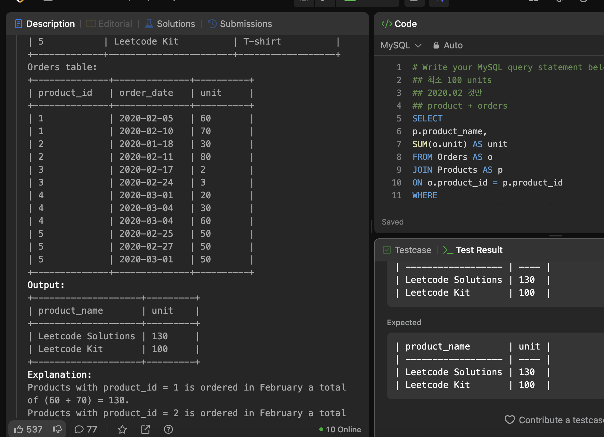
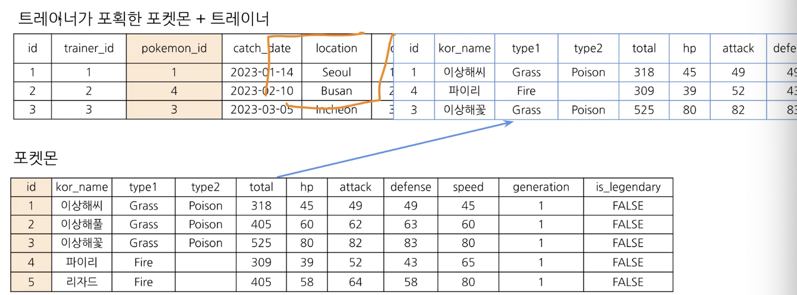
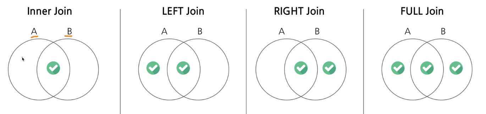
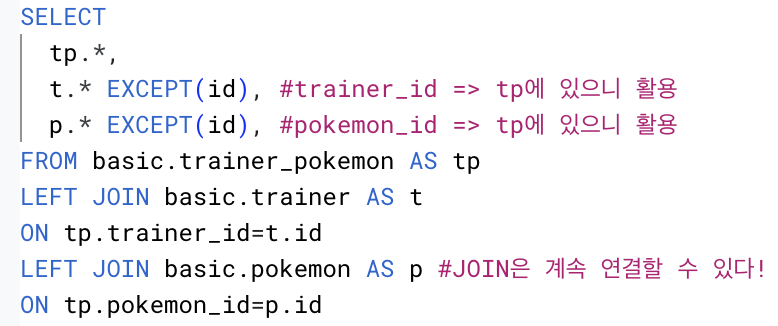
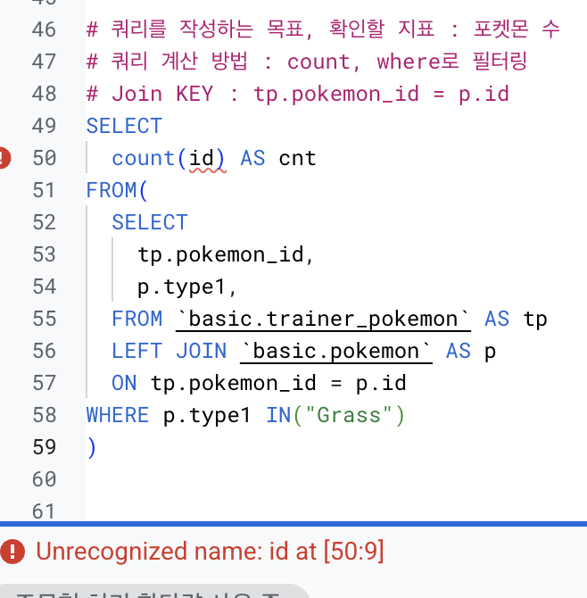
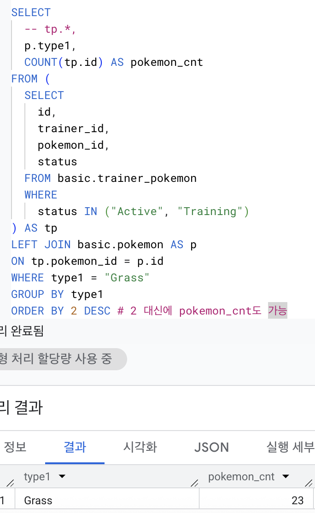
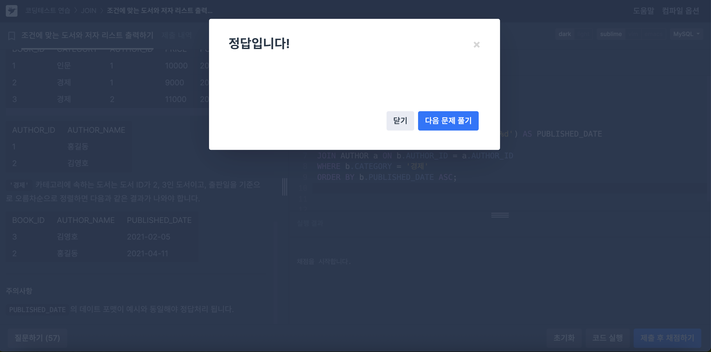
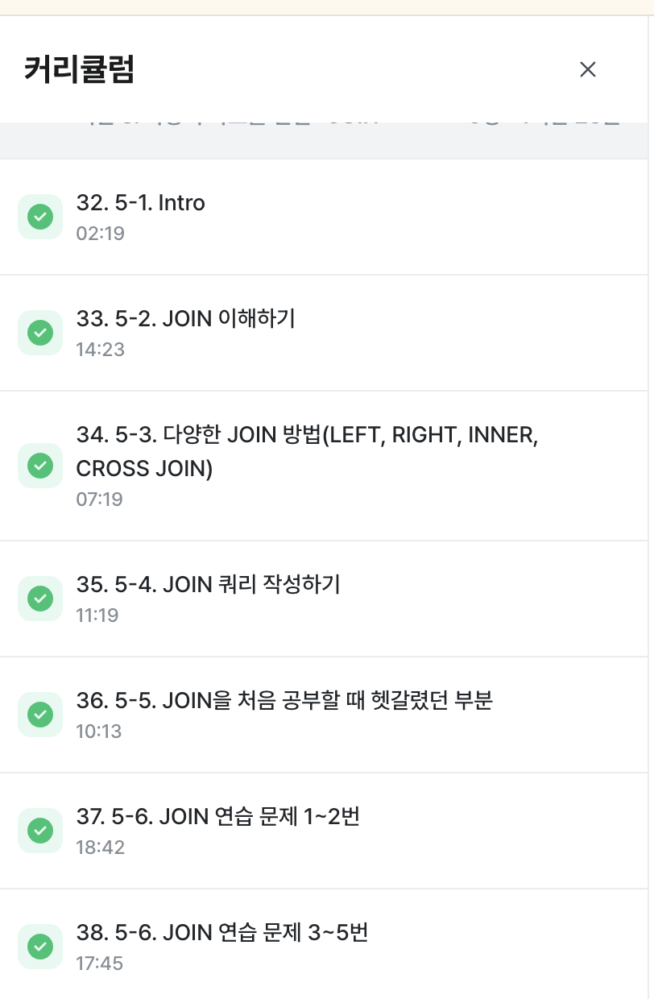

# SQL_BASIC 6주차 정규 과제 

📌SQL_BASIC 정규과제는 매주 정해진 분량의 `초보자를 위한 BigQuery(SQL) 입문` 강의를 듣고 간단한 문제를 풀면서 학습하는 것입니다. 이번주는 아래의 **SQL_Basic_6th_TIL**에 나열된 분량을 수강하고 `학습 목표`에 맞게 공부하시면 됩니다.

**6주차 과제는 강의 내용을 정리하는 것과 함께, 프로그래머스에서 제공하는 SQL 문제를 직접 풀어보는 실습도 병행합니다.** 강의에서는 **배운 내용을 정리하고 주요 쿼리 예제를 정리**하며, 프로그래머스 문제는 **직접 풀어본 뒤 풀이 과정과 결과, 배운 점을 함께 기록**해주세요. 완성된 과제는 Github에 업로드하고, 링크를 스프레드시트 'SQL' 시트에 입력해 제출해주세요.

**(수행 인증샷은 필수입니다.)** 

## SQL_BASIC_6th

### 섹션 6. 다량의 자료를 연결 : JOIN 

### 5-1. Intro

### 5-2. JOIN 이해하기

### 5-3. 다양한 JOIN 방법

### 5-4. JOIN 쿼리 작성하기 

### 5-5. JOIN을 처음 공부할 때 헷갈렸던 부분

### 5-6. JOIN 연습문제 1~2번

### 5-6. JOIN 연습문제 3~5번

### 5-7. 정리

## 🏁 강의 수강 (Study Schedule)

| 주차  | 공부 범위              | 완료 여부 |
| ----- | ---------------------- | --------- |
| 1주차 | 섹션 **1-1** ~ **2-2** | ✅         |
| 2주차 | 섹션 **2-3** ~ **2-5** | ✅         |
| 3주차 | 섹션 **2-6** ~ **3-3** | ✅         |
| 4주차 | 섹션 **3-4** ~ **4-4** | ✅         |
| 5주차 | 섹션 **4-4** ~ **4-9** | ✅         |
| 6주차 | 섹션 **5-1** ~ **5-7** | ✅         |
| 7주차 | 섹션 **6-1** ~ **6-6** | 🍽️         |

<!-- 여기까진 그대로 둬 주세요-->

 

---

# 1️⃣ 개념정리

## 5-2. JOIN 이해하기

~~~
✅ 학습 목표 :
* JOIN에 대한 정의와 필요성에 대해 설명할 수 있다.
~~~

### JOIN : 서로 다른 데이터 테이블을 연결하는 것
✔️포켓몬으로 join 개념 이해하기  
- 기본 설정
    - 포켓몬 _ 다양한 곳에서 나타남 
    - 트레이너 _ 포획한 포켓몬을 육성할 수 있음 
- 두 데이터를 연결할 수 있는 공통 값(**key**)이 없음
    - 💡tip. `**_id` 등의 공통된 컬럼이 있는지 확인
    - [trainer_pokemon] 데이터에서 확인 가능 

1. 트레이너가 포획한 포켓몬을 기준으로 트레이너 데이터를 연결하기 
- 연결할 수 있는 key(**공통 key**) = `trainer_id`, `id`
- 

2. 새로 생성된 위 데이터에 (추가로) 포켓몬 데이터 연결하기 
- 

3. 이렇게 새로 만든 테이블(큰 table) 로 데이터 가공하는 것
 
> ☑️ 테이블 구조에 익숙하지 않아서 어려움을 느낄 확률이 높음
>> 데이터 저장 형태 파악 -> join 후 모습 예상 -> 쿼리 실행 -> 이 과정 반복 

> ☑️ **join을 하는 이유?**
>> 데이터 저장되는 형태에 대한 이해가 필요
>> 관계형 데이터베이스(RDBMS) 설계시 정규화 과정을 거침
>> 중복을 최소화하게 데이터를 구조화(하나씩)
>> 데이터 분석 관점에서 join이 되어있는 것이 좋을 수 있지만 개발 관점에서 분리되어 있는 것이 좋음!
>> ✔️ [데이터 웨어하우스] join + 필요한 연산 => "데이터 마트" 만들어서 활용함. 

## 5-3. 다양한 JOIN 방법

~~~
✅ 학습 목표 :
* JOIN 방법들의 종류를 설명할 수 있다. 
* 각 JOIN 방법들의 차이점에 대해서 설명할 수 있다. 
~~~

  
   

### LEFT : 왼쪽 테이블 기준으로 연결
### RIGHT : 오른쪽 테이블 기준으로 연결
### INNER JOIN : 두 테이블의 공통 요소만 연결
### CROSS JOIN : 두 테이블 각각의 요소를 곱하기
### FULL (OUTER) JOIN : 양쪽 기준으로 연결

## 5-4. JOIN 쿼리 작성하기 

~~~
✅ 학습 목표 :
* JOIN을 사용한 문법에 대해 이해하여 적용할 수 있다.
* JOIN 을 활용한 쿼리를 작성할 수 있다. 
~~~

> 💡JOIN 쿼리 작성 흐름
>> 1. **테이블 확인**: 저장된 데이터, 컬럼 확인
>> 2. **기준 테이블 정의**: 가장 많이 참고할 기준(base) 테이블 정의
>> 3. **JOIN key 찾기**: 테이블들끼리 연결할 key 찾기
>> 4. **결과 예상하기**: 일종의 정답지 역할로 결과 예상하여 손 또는 엑셀로 작성하기 
>> 5. **쿼리 작성 / 검증**: 예상 결과와 동일한 결과가 나오는지 확인하기

> 💡JOIN 쿼리 작성 tip
>> 테이블 이름이 길 수 있기 때문에 **별칭(Alias)** 지정

### JOIN 문법
~~~sql
SELECT
    A.col1,
    B.col2
FROM table1 AS A
LEFT JOIN table2 AS B
ON A.key = B.key    #alias 사용
~~~

- `CROSS JOIN`제외하고는 `ON`필요함!
- e.g. trainer_id컬럼 기준으로 트레이너 데이터를 연결하기
  

## 5-6. JOIN을 처음 공부할 때 헷갈렸던 부분

1. 어떤 JOIN을 사용할까?
- 작업의 목적에 따라 달라짐
    - 교집합: INNER
    - 모두 다 조합: CROSS
    - 그 외: LEFT or RIGHT ; LEFT 추천
- 쿼리 작성 쳄플릿에 예상 결과를 작성하고, 중간 결과도 생각하면서 찾아보기

2. 어떤 table을 왼쪽에 둘까?
- (LEFT JOIN) 기준이 되는 table을 왼쪽에!
- 기준에는 **기준값(필요한 데이터 요소가 빠짐없이 존재하는가)**, 우측에 데이터 계속 추가한다

3. 여러 table에 연결할 수 있을까?
- YES, 개수에 한계는 없음
- 너무 많이 JOIN하고 있는게 아닌가에 대한 확인은 필요함(3~5개 정도가 적당)

4. 컬럼은 모두 다 선택해야할까?
- 무엇을 하고자 하는지에 따라 다름
- **사용하지 않을 컬럼을 선택하지 않는 것**이 비용을 줄일 수 있음!
- id같은 값은 unique한지 확인하기 위해 자주 사용되므로 넣는게 좋을 확률 높음!

5. NULL
- 값이 없음, 알 수 없음
- 0이나 공백과 다르게 값이 아예 없는 것.
- JOIN에서는 연결할 값이 없는 경우 나타남!

## 5-6. JOIN 연습문제 1~5번 

~~~
✅ 학습 목표 :
* 연습문제(3문제 이상) 푼 것들 정리하기
~~~

### 1번. 트레이너가 보유한 포켓몬들은 얼마나 있는지 알 수 있는 쿼리를 작성해주세요.
<오답>   
- 이유: 필터링을 어디다, 어떻게 해야될지 모르겠어서 못씀.  
<정답>    

### 2번. 각 트레이너가 가진 포켓몬 중에서 'Grass'타입의 포켓몬 수를 계산해주세요.
<오답> 
<정답> 
- '보유한'의 의미 생각하지 않고 필터링 못함
- join 후 'grass'타입 필터링할 때는 이미 테이블이 하나로 만들어진 상태니까 `p.type1` 이라고 쓰면 안 돼

### 3번. 트레이너의 고향과 포켓몬을 포획한 위치를 비교하여, 자신의 고향에서 포켓몬을 포획한 트레이너의 수를 계산해주세요.(status상관없이)

<쓴 답>
- `WHERE tp.location IS NOT NULL` 실무에선 이거 추가해주면 좋음

 

 

---

# 2️⃣ 확인문제 & 문제 인증

## 프로그래머스 문제 

https://school.programmers.co.kr/learn/courses/30/lessons/164673

> 조건에 부합하는 중고거래 댓글 조회하기 (JOIN)

https://school.programmers.co.kr/learn/courses/30/lessons/144854

> 조건에 맞는 도서와 저자 리스트 출력하기 (JOIN)

<학습인증>

---

# 3️⃣ 참고자료

JOIN 에 대해서 그림으로 쉽게 이해할 수 있는 자료들도 있어서 첨부합니다. 아래의 블로그도 학습할 때 같이 참고해주세요.

1. https://data-marketing-bk.tistory.com/entry/SQL-JOIN-%ED%95%9C-%EB%B0%A9%EC%97%90-%EC%A0%95%EB%A6%AC-%EA%B0%9C%EB%85%90%EB%B6%80%ED%84%B0-%EC%BD%94%EB%93%9C%EA%B9%8C%EC%A7%80-%EC%9D%B4%EA%B2%83%EB%A7%8C-%EB%B3%B4%EC%9E%90

2. https://velog.io/@wijoonwu/JOIN

 

### 🎉 수고하셨습니다.
